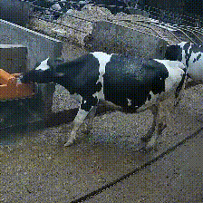

# ViTCow Project – SAM3 Video Segmentation Pipeline

This repository implements a **complete video segmentation and cropping pipeline** built on top of **SAM3 (Segment Anything Model 3)**. It is designed to generate a dataset of short video clips focusing on **individual cows and their behavior**, using videos captured by **cameras installed in cattle stables**.

<p align="center">
  
</p>

The pipeline enables you to:
- split long videos into short clips
- segment objects from a **text prompt** using **SAM3**
- track detected objects across each clip
- generate per-object cropped output videos

This repository acts as an **orchestration layer** around the official **SAM3** repository. It handles video retrieval from the cloud, data preparation, inference, tracking, output generation, and uploads the resulting crops back to the cloud.

**Coming next:** pretraining a self-supervised video model (**VideoMAE**) on the generated dataset, followed by fine-tuning for **cow behavior classification**.

---

## Running the Pipeline : On `https://mydocker.centralesupelec.fr`

**Note:** If you have already set up the environment and successfully run the pipeline once, you do **not** need to recreate the virtual environment. However, after restarting the VM, you must run the following commands:

```bash
. .venv/bin/activate
sudo apt update
sudo apt install -y libgl1
```

You will also need to re-authenticate using your Hugging Face token (see Section 3).
Then you can launch the pipeline as usual.

### 1. Environment

We create a venv to isolate the environment. First install python and dependencies : 

```bash
sudo apt update && sudo apt install -y python3.12 python3.12-venv libgl1 libglib2.0-0 git
```

Then, create the environment and download requirements : 

```bash
python3.12 -m venv .venv && . .venv/bin/activate && pip install --upgrade pip && pip install -r requirements_vm.txt
```

### 2. Clone the Repo 

```bash
git clone https://github.com/MariusCharles/PFR-ViTCow.git
cd PFR-ViTCow/
```


### 3. Access Requirements (Hugging Face)

SAM3 is a **gated model** hosted on Hugging Face.  
Before using this pipeline, you must **request access** and **authenticate locally**.

#### A- Request access to SAM3

You must request access on the official SAM3 Hugging Face page  
(approval required by Meta / Facebook Research).

> ⚠️ Without approval, the model weights cannot be downloaded.

#### B- Authenticate with your Hugging Face account

Once access is granted, log in locally (change "your_token" with the token obtained on huggingface website):

```bash
python - << 'EOF'
from huggingface_hub import login
login(token="your_token")
print("HF login successful")
EOF
```


### 4. Choose `max_num_objects`

You can control the maximum number of objects detected by SAM3 using the `max_num_objects` parameter.  
This helps regulate GPU memory usage and allows you to limit how many cows are kept per clip.

To modify this parameter, we update an internal SAM3 configuration value. ⚠️ Be careful if you cloned multiple SAM3 repos, to indicate the correct path (usually in the .venv folder). ⚠️

To update the maximum number of objects handled by SAM3, run:

```bash
bash update_max_objects.sh <path_to_sam3_repo> <max_num_objects>
```

For example, to set `max_num_objects` to 10 on `centrale mydocker` :

```bash
bash update_max_objects.sh .venv/src/sam3/ 10
```

### 5. Set-up config file

The `config.py` file contains all the necessary configuration parameters for the pipeline, including SFTP settings, folder paths, and extraction parameters. Ensure the file is properly configured before running the pipeline.

Key parameters to configure:

- **FARM_NAMES**: The code is automatically configured to randomly sample from all available farms (it is recommended to keep the full list unless you want to target a specific farm).
- **NUM_FRAMES_PER_CLIP**: Number of frames in the output video clips (e.g., 20 frames correspond to an output clip of approximately 7 seconds at 12 fps and cover approximately 4 seconds of the original video at 20 fps).
- **FRAME_STEP**: Downsampling stride (for example, with a stride of 4 and NUM_FRAMES_PER_CLIP = 20, the pipeline processes 80 frames from the original video and outputs 20).
- **PROMPT_CLASS**: Change the text prompt for object detection (e.g., 'cow').
- **SAFETY_MARGIN**: Expansion factor applied to the bounding box to avoid cropping the detected object.
- **START, END**: Define daytime hours for video processing.

The structure of `config.py`:

```python
from pathlib import Path

# Get project root (current directory of this config file)
PROJECT_ROOT = Path(__file__).resolve().parent

# SFTP parameters
SFTP_USER = "sftpiodaa"
SFTP_HOST = "88.189.55.27"
SFTP_PORT = 22222

REMOTE_DIR = "/PACECOWVID"
UPLOAD_DIR = "/PACECOWVID/ViTCow_upload"
FARM_NAMES = {
            "BUISSON": REMOTE_DIR + "/BUISSON/20241016 - BUISSON/CUT",
            "COPTIERE": REMOTE_DIR + "/COPTIERE",
            "CORDEMAIS": REMOTE_DIR + "/CORDEMAIS",
            "CYPRES": REMOTE_DIR + "/CYPRES",
            "SAULAIE": REMOTE_DIR + "/SAULAIE/20250327 - Saulaie - Regis Bedouet"
            }
TEST_FOLDER="CORDEMAIS"
PRETRAIN_DIR= "pretraining_dataset"

# Folder management
CLIP_FOLDER = PROJECT_ROOT / "clips"
CROP_FOLDER = PROJECT_ROOT / "crops"
LOCAL_TMP_DIR = PROJECT_ROOT / "data"   # for sftp downloads

# Extraction / Crops parameters
NUM_FRAMES_PER_CLIP = 20
FRAME_STEP = 4
NUM_CLIP = 10

CROP_SIZE = 224
PROMPT_CLASS = "cow"

# Margin for BBox expansion (fraction of max side)
SAFETY_MARGIN = 0.1  # 10% margin

# Time range for extraction 
START = 9   # Start hour (9 AM)
END = 17    # End hour (5 PM)

# Creates folders automatically 
for d in [CLIP_FOLDER, CROP_FOLDER, LOCAL_TMP_DIR]:
    d.mkdir(parents=True, exist_ok=True)
```

### 6. Running the Pipeline

The main entry point is:

```bash
python main.py
```


## Running the Pipeline : Locally or on Lightning AI 

### 1. Environment

- **Python 3.12 (required)**
- NVIDIA GPU recommended (CUDA)

If you are running the code locally, create a dedicated Conda environment:

```bash
conda create -n sam3-pipeline python=3.12
conda activate sam3-pipeline
```

If you are running this project on Lightning AI (Studio / CloudSpace), skip this step.

---

### 2. Clone the Repo 

```bash
git clone https://github.com/MariusCharles/PFR-ViTCow.git
cd PFR-ViTCow/
```

---

### 3. Python Dependencies

Install dependencies:

```bash
pip install -r requirements.txt
```

---

### 4. External Dependency: SAM3

SAM3 is **not distributed on PyPI** and must be cloned from the official repository.

#### Official repository

 https://github.com/facebookresearch/sam3

#### Installation

```bash
git clone https://github.com/facebookresearch/sam3.git
pip install -e sam3
```

The `sam3/` directory must be present in the directory or otherwise available in your `PYTHONPATH`.
If you encounter dependency issues at this step, retry the previous step using the alternative requirements file.

---

### 3bis & 4bis. If it fails

Skip this section if everything is working correctly.

If you encounter dependency conflicts (including when running `main.py`), try installing the alternative requirements file:

```bash
pip install -r requirements_v2.txt
```

⚠️ **Important:**  
This will install both the Python dependencies **and** the SAM3 repository as a package.  
In this setup, SAM3 will be installed inside a `src/` directory.

Keep this in mind when modifying the `max_num_objects` parameter, as the file path to SAM3 may differ from the default setup.

---

### 5. Access Requirements (Hugging Face)

SAM3 is a **gated model** hosted on Hugging Face.  
Before using this pipeline, you must **request access** and **authenticate locally**.

#### A- Request access to SAM3

You must request access on the official SAM3 Hugging Face page  
(approval required by Meta / Facebook Research).

> ⚠️ Without approval, the model weights cannot be downloaded.

#### B- Authenticate with your Hugging Face account

Once access is granted, log in locally:

```bash
huggingface-cli login
```

If it fails, try : 

```bash
python - << 'EOF'
from huggingface_hub import login
login(token="your_token")
print("HF login successful")
EOF
```

---

### 6. Choose `max_num_objects`

You can control the maximum number of objects detected by SAM3 using the `max_num_objects` parameter.  
This helps regulate GPU memory usage and allows you to limit how many cows are kept per clip.

To modify this parameter, we update an internal SAM3 configuration value.

To update the maximum number of objects handled by SAM3, run:

```bash
bash update_max_objects.sh <path_to_sam3_repo> <max_num_objects>
```

For example, to set `max_num_objects` to 5, in a LightningAI setup:

```bash
bash update_max_objects.sh /teamspace/studios/this_studio/PFR-ViTCow/sam3 5
```

> This modification will later be moved directly into the configuration file.

---

### 7. Running the Pipeline

The main entry point is:

```bash
python main.py
```


##  Repository Architecture

### Directory Structure

```text
repo/
├── main.py                 # Global pipeline orchestration
├── config.py               # Global configuration
├── requirements.txt
│
├── sam/                     # SAM3 wrapper
│   ├── sam_session.py       # SAM3 video session handling
│   └── __init__.py
│
├── video/                   # Video processing utilities
│   ├── clipper.py           # Video clipping
│   ├── cropper.py           # Bounding boxes, cropping, video writing
│   └── __init__.py
│
├── pipeline/
│   ├── extractor.py         # SAM → BBox → Crop pipeline
│   └── __init__.py
│
├── sam3/                    # Official SAM3 repository (git clone)
└── README.md
```

---

##  Architecture Diagram

```text
┌────────────────────┐
│   Input Videos     │
└─────────┬──────────┘
          │
          ▼
┌────────────────────┐
│  video/clipper     │  Video clipping
└─────────┬──────────┘
          │
          ▼
┌────────────────────┐
│  SAMSession        │  (sam/sam_session.py)
│  - start_session   │
│  - add_prompt      │
│  - propagate       │
└─────────┬──────────┘
          │
          ▼
┌────────────────────┐
│ pipeline/extractor │
│ - masks → bbox     │
│ - padding          │
│ - crop             │
└─────────┬──────────┘
          │
          ▼
┌────────────────────┐
│  Cropped Videos    │
└────────────────────┘
```

---


## 📄 License

This repository provides an application-level pipeline.

The model weights and license are defined by the official **SAM3 (Facebook Research)** repository.

---

##  References

- SAM3: https://github.com/facebookresearch/sam3
- Segment Anything: https://github.com/facebookresearch/segm

